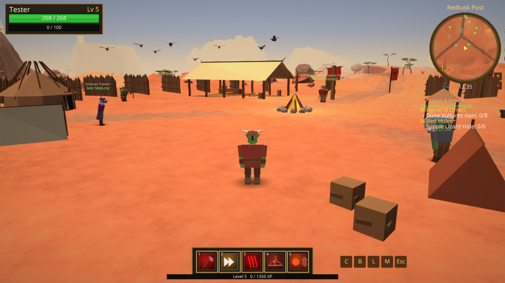
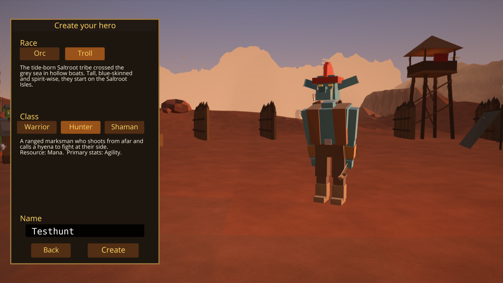
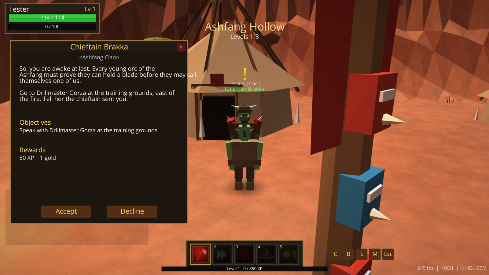
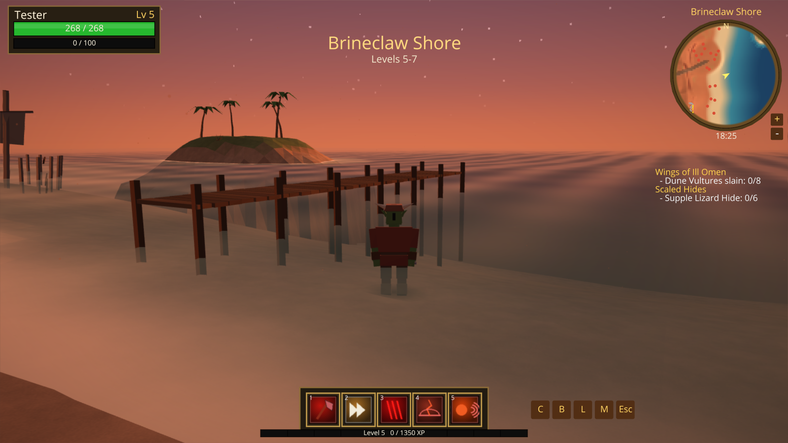
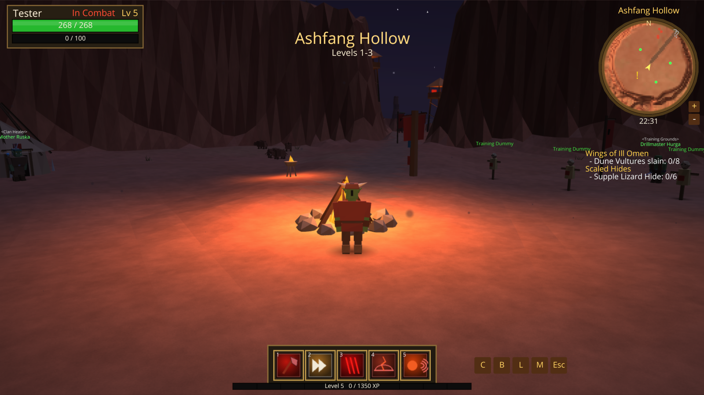
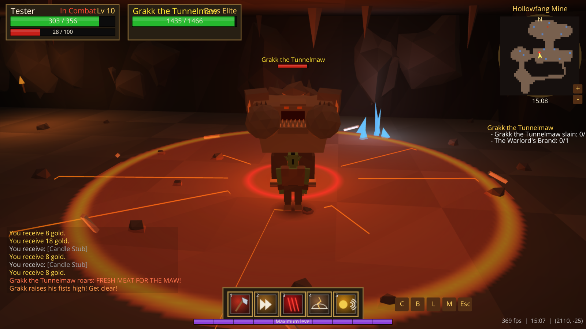
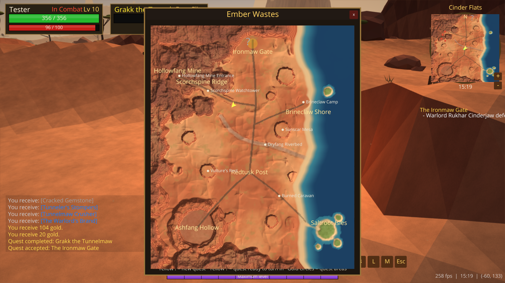

# Ember Wastes

A single-player 3D fantasy action RPG for Windows, written in Python with the [Ursina](https://www.ursinaengine.org/)
engine. You play one fully explorable starting zone, the **Ember Wastes**: a red-rock desert on the east coast of a continent,
home to the orc clans and a sea-faring troll tribe.

Every model, texture, icon and sound is generated by code at start-up. There are no external art or audio files, and all
names, characters, places and quests are original.



| | |
|---|---|
|  |  |
|  |  |
|  |  |

## Download and play (Windows, no Python needed)

1. Download **`EmberWastes-v1.0.0-windows-x64.zip`** from the
   [latest release](https://github.com/aoancea/ember-wastes/releases/latest).
2. Right-click the zip and choose **Extract All**.
3. Open the extracted `EmberWastes` folder and double-click **`EmberWastes.exe`**.

The game isn't code-signed, so Windows may show *"Windows protected your PC"*. Click **More info → Run anyway**.
The first launch takes a few extra seconds while the sounds are generated. Saves are stored in a `saves` folder next to the exe.

To run from source instead, see [Setup](#setup) below.

## Features

- **An open zone of about 640 x 770 units** with seven regions: Ashfang Hollow (orc start), Saltroot Isles (troll start),
  Redtusk Post (hub town), Scorchspine Ridge, Brineclaw Shore, the Hollowfang Mine dungeon and the Ironmaw Gate.
- **Procedural terrain**: canyons, mesas, dry riverbeds, thorny trees, beaches and islands, an animated sea with shoreline
  foam, a full day/night cycle with stars and moon, drifting dust and heat haze.
- **Races and classes**: Orc or Troll, then Warrior (rage), Hunter (mana, ranged, pet) or Shaman (mana, spells, totem).
  Each class has 5 abilities with cooldowns, unlocked at levels 1/2/4/6/8 and upgradable in ranks at the trainer.
- **Levels 1-10**: stat growth per class, level-up effect and fanfare, XP from kills and quests.
- **Combat**: tab and click targeting, auto-attack, aggro radius, leashing, respawns, floating numbers, telegraphed boss
  attacks, 13 enemy types and 2 multi-phase bosses (Grakk the Tunnelmaw and the Warlord).
- **20 quests** (16 per character): kill, collect, deliver, explore and escort, with a story that ends at the Ironmaw Gate.
- **Loot and gear**: common/uncommon/rare items, 5 equipment slots that change your character's appearance, bags,
  vendors and gold.
- **UI**: unit frames, target frame, hotbar, XP bar, cast bar, nameplates, quest tracker, quest log, bags, character
  sheet, circular minimap and world map, main menu, character creation with a 3D preview, pause menu, settings, and save/load.

## Requirements

- Windows 10/11 (other platforms supported by Ursina may work but are untested)
- Python **3.11 or newer** (tested with 3.12)
- A GPU that supports OpenGL 3.2+

## Setup

```bat
cd path\to\3d-game-wow
py -3.12 -m venv .venv
.venv\Scripts\activate
pip install -r requirements.txt
```

## Run

```bat
python main.py
```

The first start takes a few extra seconds while the sound effects are synthesised into `cache\`.

Other launch options:

| Command | What it does |
|---|---|
| `python main.py --quickstart orc warrior Urzag` | skip the menus and start a new character (race, class, name) |
| `python main.py --novsync` | uncapped frame rate (for measuring performance) |
| `python main.py --size 1920x1080` | override the window size |
| `python main.py --autotest m4` | run a scripted smoke test (see *Testing*) |

## Controls

| Input | Action |
|---|---|
| `W A S D` / arrow keys | move (relative to the camera); `Q`/`E` also strafe |
| hold **Right mouse** + drag | rotate the camera and turn your character |
| hold **Left mouse** + drag | rotate the camera only |
| both mouse buttons | run forward |
| mouse wheel | zoom |
| `Space` | jump |
| hold `Shift` | walk |
| **Left click** | select a target |
| **Right click** | attack, talk to an NPC, loot a corpse or use a quest object |
| `Tab` / `Shift+Tab` | cycle hostile targets |
| `1`-`5` | abilities |
| `R` | toggle auto-attack on the current target |
| `F` | interact with the nearest NPC, corpse or quest object |
| `B` / `C` / `L` / `M` | bags / character / quest log / world map |
| `Esc` | close the top window, clear the target, or open the pause menu |

## Getting started

1. **New Game**: pick Orc or Troll, a class and a name.
2. Orcs start in **Ashfang Hollow** (south-west canyon). Talk to **Chieftain Ghorvash** (yellow `!`).
   Trolls start on the **Saltroot Isles** (south-east islands). Talk to **Elder Wazuko**.
3. After the starting chain (about level 3) you are sent to **Redtusk Post**, the crossroads town. There you'll find:
   - **Overseer Kazreth**, the main story giver
   - class trainers for new abilities and ranks: **Warmaster Koltrak** (Warrior), **Huntmaster Sika** (Hunter) and
     **Seer Makuna** (Shaman)
   - vendors: **Quartermaster Hesk** (arms, armor, potions) and **Mama Oshra** (inn: food, drink, potions)
4. The story then takes you east to the burned caravan, north-east to **Brineclaw Shore**, north-west up
   **Scorchspine Ridge** into the **Hollowfang Mine** to face Grakk, and finally north to the **Ironmaw Gate**.

Tips: eat and drink out of combat (right-click food in your bags), keep a couple of potions for bosses, and step out of red
ground circles, which mark incoming boss attacks. Grey-named enemies give no XP.

## Saving

- **Esc -> Save Game** writes `saves\<CharacterName>.json`. The game also saves when you create a character, return to the
  main menu, quit from the pause menu, and win the game.
- **Continue** on the main menu loads the most recent save; **Load Game** lists all of them.
- Settings are stored in `settings.json` (mouse sensitivity, volumes, resolution, fullscreen, view distance, heat haze,
  FPS counter, invert Y).

## Editing the game data

All balance and content data is plain JSON in `data\`:

| File | Contents |
|---|---|
| `classes.json` | base stats, how stats convert to health/mana/attack power/crit/spell power, ability list, starting gear |
| `levels.json` | XP table, kill XP formula, **level-up stat gains per class**, difficulty colours |
| `abilities.json` | every ability: cost, cooldown, range, cast time, unlock level, ranks and trainer prices |
| `enemies.json` | enemy types (level-1 stats), per-level scaling, abilities and loot tables |
| `items.json` | all items: slot, rarity, level, stats, weapon damage and speed, prices, vendor/drop flags |
| `npcs.json` | NPC names, positions, looks, greetings, vendor stock and trainer class |
| `quests.json` | quests (text, objectives, rewards, prerequisites) and clickable quest objects |
| `zones.json` | regions, landmarks, terrain features, building layouts and enemy spawn tables |

Restart the game after editing. Enemy stats scale as
`hp * (1 + hp_growth * (level - 1))` (and similarly for damage and armor), so you balance level 1 and the growth factors.

## Building a Windows .exe

```bat
pip install pyinstaller
build_exe.bat
```

The result is `dist\EmberWastes\EmberWastes.exe`. Copy the whole `dist\EmberWastes` folder to share the game. Saves,
settings and the sound cache are written next to the exe.

## Testing

`core/autotest.py` contains scripted smoke tests. Each one drives the real game for a few seconds, runs checks, saves
screenshots to `screenshots\autotest\` and quits. Every check below passes in the current build.

| Test | Covers |
|---|---|
| `m1` | terrain, movement, jumping, swimming, day/night, water, all regions |
| `m2` | tab targeting, auto-attack, kill XP, loot, respawn, aggro/leash, death and release |
| `m3` | warrior abilities, leveling with stat growth, bags, equipment, tooltips |
| `m4` | NPC dialogue, the full orc start chain, delivery to Redtusk, trainer, vendor |
| `troll`, `hunter`, `shaman`, `escort`, `gallery` | troll start chain, Hunter kit, Shaman kit, escort quest, enemy models |
| `m6` | mine dungeon, Grakk's two phases, maps, the warlord and the final quest |
| `m7` | main menu, character creation, save/load, pause, settings, victory and gate |
| `balance` | a bot plays each class at levels 1-9 plus the Grakk fight and prints fight times and health left |

Example: `python main.py --autotest m6`

## Project structure

```
main.py            entry point, window, menus vs. play
settings.py        constants and persisted user settings
save.py            JSON save/load
core/              game loop (game.py), mesh generation, shaders, textures, audio, events, data loading, autotests
world/             terrain.py (heightmap + chunks), zones.py (regions, buildings, scattering), sky.py (day/night),
                   water.py, effects.py (dust, heat haze), props.py, collision.py, dungeon.py (mine), gate.py
player/            player.py (stats, gear, combat), controller.py (movement), camera.py
progression/       stats.py (attributes -> derived values), leveling.py
combat/            combat.py (formulas), unit.py (units + auras), abilities.py, targeting.py, companions.py, effects.py
enemies/           enemy.py (AI), models.py (creature rigs), boss.py, spawner.py
npcs/              npc.py, models.py (humanoid rig for orcs, trolls, goblins)
quests/            quest_manager.py, escort.py, objects.py
items/             item.py, inventory.py, loot.py
ui/                hud.py, frames.py, hotbar.py, minimap.py, dialogue.py, questlog.py, inventory_ui.py, character_ui.py,
                   vendor_ui.py, trainer_ui.py, loot_ui.py, menus.py, messages.py, icons.py, widgets.py
data/              editable JSON content
```

## Performance notes

- Terrain is built as 120 flat-shaded chunks, and static props are merged into one mesh per 64 x 64 area.
- Chunks and props beyond the view distance are hidden, and fog hides the cut-off.
- Enemies more than 150 units away don't run AI, distant creatures animate at reduced rates, and dust particles are
  animated entirely on the GPU.
- On the development machine (RTX 5070 Ti) the game runs at 250-400 FPS uncapped at 1600x900. If your frame rate is
  low, lower **View distance** or turn off **Heat haze** in Settings.

## Troubleshooting

- **Black or white screen, or a crash at start**: update your GPU driver. Deleting `settings.json` resets the resolution.
- **No sound**: check the volume sliders in Settings, then delete `cache\` to regenerate the sounds.
- **A quest NPC is missing its `!`**: check the level and prerequisites in the quest log. Some quests need earlier quests
  first.
